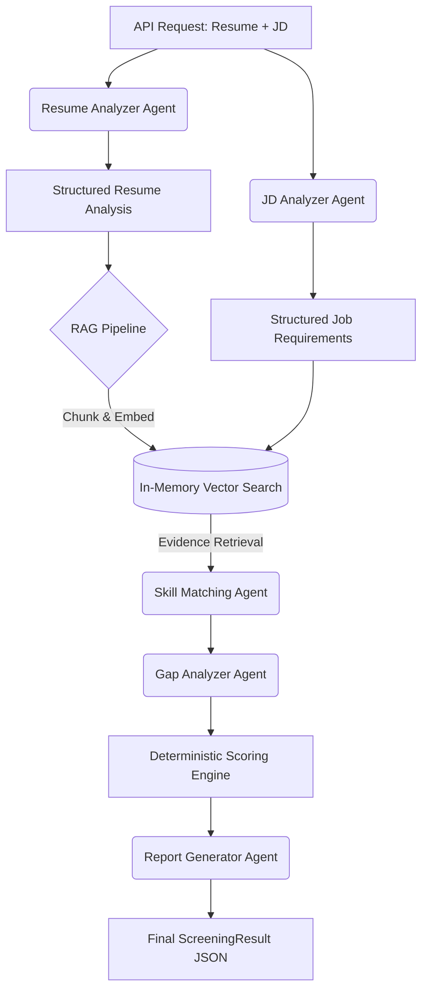

# 🚀 AI Resume Screening Assistant

> **AI-powered candidate screening and verification platform** developed for the 2026 Prodapt Hackathon.

An intelligent, multi-agent pipeline designed to automate and enhance technical recruitment. The system analyses job descriptions and resumes, intelligently matches candidate skills and experience against requirements, and provides an evidence-backed, recruiter-friendly screening report.

---

## 🌟 Key Features

- **Multi-Agent Orchestration**: Five specialised AI agents collaborating via a single Gemini LLM.
- **RAG-Powered Evidence**: Extracts resume text with page-awareness, chunks it, and retrieves evidence to back up every skill match.
- **Deterministic Scoring**: Eliminates LLM bias by calculating the final candidate score using a strict Python-based formula.
- **Fair Gap Analysis**: Identifies missing skills as `NO_EVIDENCE` rather than incorrectly claiming a candidate "lacks" a skill.
- **Graceful Persistence**: Automatically saves screening results, candidates, and job requirements to PostgreSQL if available, while degrading gracefully to in-memory processing if the database is offline.

---

## 🏗️ System Architecture

The application relies on a FastAPI backend orchestrating a multi-agent AI pipeline. 

### Pipeline Flow



### Component Breakdown
1. **Resume Agent**: Extracts structured data (experience, education) from raw text.
2. **JD Agent**: Extracts mandatory and preferred skills from the job description.
3. **Retrieval Service**: Chunks the resume and performs cosine similarity search using Gemini's `text-embedding-004` to find evidence backing up skills.
4. **Matching & Gap Agents**: Classifies skill matches (Match, Partial, No Evidence) and severity of missing skills.
5. **Scoring Engine**: Evaluates the candidate using a weighted, deterministic algorithm.
6. **Report Agent**: Summarises the candidate's strengths and weaknesses for a human recruiter.

---

## 📂 Project Structure

```text
prodapt-hackathon/
├── app/                       ← AI Application
│   ├── agents/                # Specialised LLM agents (resume, jd, matching, gap, report)
│   ├── services/              # Document Parsing, RAG Retrieval, Embedding, and LLM services
│   ├── schemas/               # Pydantic structured output models
│   ├── scoring/               # Deterministic scoring engine
│   ├── api/                   # REST API routes (Auth)
│   ├── core/                  # Security (JWT) and Configuration (pydantic-settings)
│   ├── pipeline.py            # End-to-end orchestration
│   └── main.py                # FastAPI entry point
│
├── database/                  ← PostgreSQL database layer
│   ├── README.md              # Database setup guide
│   ├── run_migrations.sh      # Migration runner
│   └── migrations/            # Versioned SQL schemas
│
└── tests/                     ← Pytest Unit & Integration tests
```

---

## 🛠️ Tech Stack

| Component | Technology | Cost / License |
| :--- | :--- | :--- |
| **Backend Framework** | FastAPI, Python 3 | Open Source |
| **AI / LLM** | Google Gemini (2.0 Flash) | Free Tier |
| **Embeddings** | text-embedding-004 | Free Tier |
| **Database** | PostgreSQL 15+ & pgvector | Open Source |
| **Authentication** | JWT (python-jose) | Open Source |

---

## 🚀 Getting Started

### 1. Database Setup (Optional)
The system degrades gracefully without a database, but to enable persistence:
```bash
# Start PostgreSQL via Docker
docker run -d --name screening-db -e POSTGRES_PASSWORD=postgres -e POSTGRES_DB=screening_db -p 5432:5432 pgvector/pgvector:pg16

# Run migrations
cd database
./run_migrations.sh --seed     # Linux/macOS
run_migrations.bat --seed      # Windows
```

### 2. Backend Setup
```bash
# Create and activate virtual environment
python -m venv venv
venv\Scripts\activate        # Windows
# source venv/bin/activate   # Linux/Mac

# Install dependencies
pip install -r requirements.txt

# Configure environment variables
copy .env.example .env
# Edit .env and add your GEMINI_API_KEY, JWT_SECRET_KEY, and DATABASE_URL
```

### 3. Run the API
```bash
uvicorn app.main:app --reload --port 8000
```

---

## ⚡ API Usage

### 1. Obtain Auth Token
Authenticate with the demo credentials from your `.env`:
```bash
curl -X POST http://localhost:8000/auth/login \
  -H "Content-Type: application/json" \
  -d '{"username": "admin", "password": "admin"}'
```

### 2. Screen a Resume (PDF/DOCX Upload)
Pass the Bearer token returned from the login endpoint:
```bash
curl -X POST http://localhost:8000/screen/upload \
  -H "Authorization: Bearer <YOUR_TOKEN>" \
  -F "resume_file=@/path/to/resume.pdf" \
  -F "job_description=Senior ML Engineer requiring Python..."
```

---

## 🧪 Testing

The platform includes comprehensive test coverage for agents, scoring engines, schema validation, and API endpoints.

```bash
# Run unit tests (No API key required)
pytest tests/test_scorer.py tests/test_schemas.py tests/test_retrieval.py tests/test_config.py tests/test_document.py -v

# Run full integration tests (Requires GEMINI_API_KEY)
pytest tests/test_api.py -v -s
```
