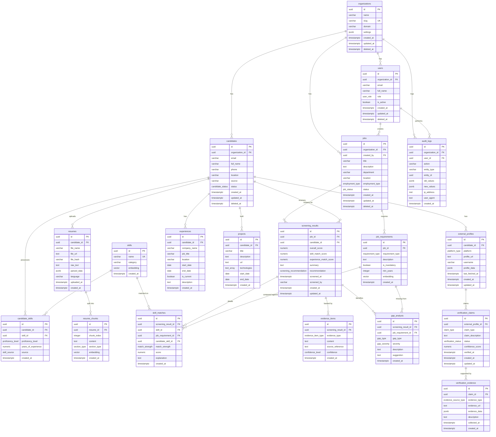
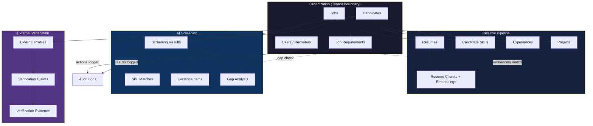

# Entity Relationship Diagram

## Full Schema ER Diagram

```mermaid
erDiagram
    organizations ||--o{ users : "has"
    organizations ||--o{ jobs : "has"
    organizations ||--o{ candidates : "has"
    organizations ||--o{ audit_logs : "logs"

    users ||--o{ jobs : "creates"
    users ||--o{ audit_logs : "performs"

    jobs ||--o{ job_requirements : "requires"
    jobs ||--o{ screening_results : "screens for"

    candidates ||--o{ resumes : "uploads"
    candidates ||--o{ candidate_skills : "possesses"
    candidates ||--o{ experiences : "has"
    candidates ||--o{ projects : "built"
    candidates ||--o{ external_profiles : "has"
    candidates ||--o{ screening_results : "receives"

    resumes ||--o{ resume_chunks : "split into"

    skills ||--o{ candidate_skills : "referenced by"
    skills ||--o{ skill_matches : "matched on"

    screening_results ||--o{ skill_matches : "details"
    screening_results ||--o{ evidence_items : "backed by"
    screening_results ||--o{ gap_analysis : "identifies"

    job_requirements ||--o{ skill_matches : "compared against"
    job_requirements ||--o{ gap_analysis : "missing from"

    external_profiles ||--o{ verification_claims : "claims"
    verification_claims ||--o{ verification_evidence : "supported by"

    organizations {
        uuid id PK
        varchar name
        varchar slug UK
        varchar domain
        jsonb settings
        timestamptz created_at
        timestamptz updated_at
        timestamptz deleted_at
    }

    users {
        uuid id PK
        uuid organization_id FK
        varchar email
        varchar full_name
        user_role role
        boolean is_active
        timestamptz created_at
        timestamptz updated_at
        timestamptz deleted_at
    }

    jobs {
        uuid id PK
        uuid organization_id FK
        uuid created_by FK
        varchar title
        text description
        varchar department
        varchar location
        employment_type employment_type
        job_status status
        timestamptz created_at
        timestamptz updated_at
        timestamptz deleted_at
    }

    job_requirements {
        uuid id PK
        uuid job_id FK
        requirement_type requirement_type
        text description
        boolean is_mandatory
        integer min_years
        vector embedding
        timestamptz created_at
    }

    candidates {
        uuid id PK
        uuid organization_id FK
        varchar email
        varchar full_name
        varchar phone
        varchar location
        varchar source
        candidate_status status
        timestamptz created_at
        timestamptz updated_at
        timestamptz deleted_at
    }

    resumes {
        uuid id PK
        uuid candidate_id FK
        varchar file_name
        text file_url
        varchar file_hash
        text raw_text
        jsonb parsed_data
        varchar language
        timestamptz uploaded_at
        timestamptz created_at
    }

    resume_chunks {
        uuid id PK
        uuid resume_id FK
        integer chunk_index
        text content
        section_type section_type
        vector embedding
        timestamptz created_at
    }

    skills {
        uuid id PK
        varchar name UK
        varchar category
        vector embedding
        timestamptz created_at
    }

    candidate_skills {
        uuid id PK
        uuid candidate_id FK
        uuid skill_id FK
        proficiency_level proficiency_level
        numeric years_of_experience
        skill_source source
        timestamptz created_at
    }

    experiences {
        uuid id PK
        uuid candidate_id FK
        varchar company_name
        varchar job_title
        varchar location
        date start_date
        date end_date
        boolean is_current
        text description
        timestamptz created_at
    }

    projects {
        uuid id PK
        uuid candidate_id FK
        varchar title
        text description
        text url
        text_array technologies
        date start_date
        date end_date
        timestamptz created_at
    }

    screening_results {
        uuid id PK
        uuid job_id FK
        uuid candidate_id FK
        numeric overall_score
        numeric skill_match_score
        numeric experience_match_score
        text summary
        screening_recommendation recommendation
        timestamptz screened_at
        varchar screened_by
        timestamptz created_at
        timestamptz updated_at
    }

    skill_matches {
        uuid id PK
        uuid screening_result_id FK
        uuid skill_id FK
        uuid job_requirement_id FK
        uuid candidate_skill_id FK
        match_strength match_strength
        numeric score
        text explanation
        timestamptz created_at
    }

    evidence_items {
        uuid id PK
        uuid screening_result_id FK
        evidence_item_type evidence_type
        text content
        text source_reference
        confidence_level confidence
        timestamptz created_at
    }

    gap_analysis {
        uuid id PK
        uuid screening_result_id FK
        uuid job_requirement_id FK
        gap_type gap_type
        gap_severity severity
        text description
        text suggestion
        timestamptz created_at
    }

    external_profiles {
        uuid id PK
        uuid candidate_id FK
        platform_type platform
        text profile_url
        varchar username
        jsonb profile_data
        timestamptz last_fetched_at
        timestamptz created_at
        timestamptz updated_at
    }

    verification_claims {
        uuid id PK
        uuid external_profile_id FK
        claim_type claim_type
        text claim_description
        verification_status status
        numeric confidence_score
        timestamptz verified_at
        timestamptz created_at
        timestamptz updated_at
    }

    verification_evidence {
        uuid id PK
        uuid claim_id FK
        evidence_source_type evidence_type
        text evidence_url
        jsonb evidence_data
        text description
        timestamptz collected_at
        timestamptz created_at
    }

    audit_logs {
        uuid id PK
        uuid organization_id FK
        uuid user_id FK
        varchar action
        varchar entity_type
        uuid entity_id
        jsonb old_values
        jsonb new_values
        inet ip_address
        text user_agent
        timestamptz created_at
    }
```

## Data Flow Diagram

```mermaid
flowchart TD
    subgraph Tenant["Organization (Tenant Boundary)"]
        U[Users / Recruiters]
        J[Jobs]
        JR[Job Requirements]
        C[Candidates]
    end

    subgraph Resume["Resume Pipeline"]
        R[Resumes]
        RC[Resume Chunks + Embeddings]
        CS[Candidate Skills]
        EX[Experiences]
        PR[Projects]
    end

    subgraph Screening["AI Screening"]
        SR[Screening Results]
        SM[Skill Matches]
        EI[Evidence Items]
        GA[Gap Analysis]
    end

    subgraph Verification["External Verification"]
        EP[External Profiles]
        VC[Verification Claims]
        VE[Verification Evidence]
    end

    AL[Audit Logs]

    J --> JR
    C --> R --> RC
    C --> CS
    C --> EX
    C --> PR
    C --> EP --> VC --> VE

    J & C --> SR
    SR --> SM
    SR --> EI
    SR --> GA

    JR -.->|embedding match| RC
    JR -.->|gap check| GA

    U -->|actions logged| AL
    SR -->|results logged| AL

    style Tenant fill:#1a1a2e,color:#e0e0e0
    style Resume fill:#16213e,color:#e0e0e0
    style Screening fill:#0f3460,color:#e0e0e0
    style Verification fill:#533483,color:#e0e0e0
```
